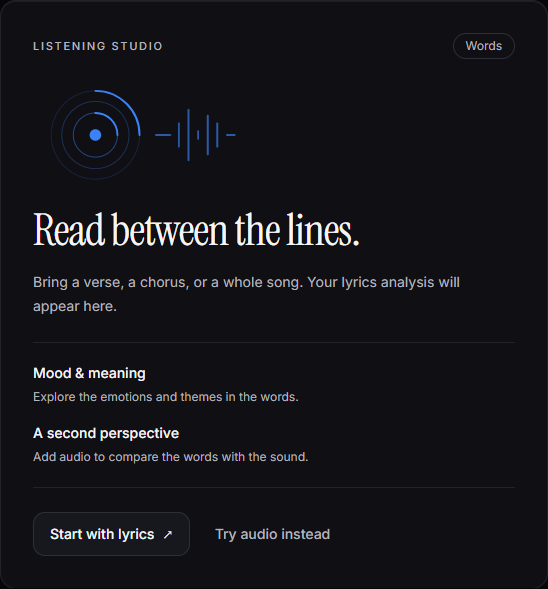
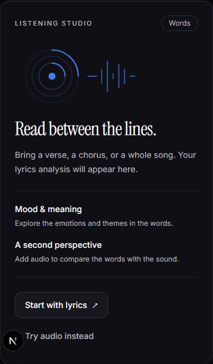

# Analysis workbench — focused interface pass

The lyrics and audio empty states now share a listening-studio panel: original
record artwork, mode-specific guidance, a clear start action and a way to try
the other engine. Lyrics entry receives keyboard focus from its start action;
changing engines returns focus to the selected tab. No placeholder result or
simulated measurement is presented as an analysis.

Errors are announced to assistive technology. Lyrics errors are associated
with the input, and the word-count helper and Clear control have more readable
text and a larger touch target. The keyboard shortcut respects the loading
state. This pass preserves the existing music-dark palette and typography.

## Verification and limits

Local Edge checks at 390, 768 and 1440px verified keyboard entry, sample
selection, switching both engines with focus return, opening the audio picker,
and the API error state. Screenshots use the application's existing fonts.
No page horizontal overflow or JavaScript runtime errors were observed.
The API failure was deliberately intercepted locally; no paid inference was
called and no audio file was uploaded during this check.

Type checking, changed-file lint and the existing result-identity regressions
passed. This is a bounded empty/error-state refinement, not complete visual
coverage of populated analyses, identification, discovery or the atlas.
The pre-existing preview-fetch race remains separate reliability work.
